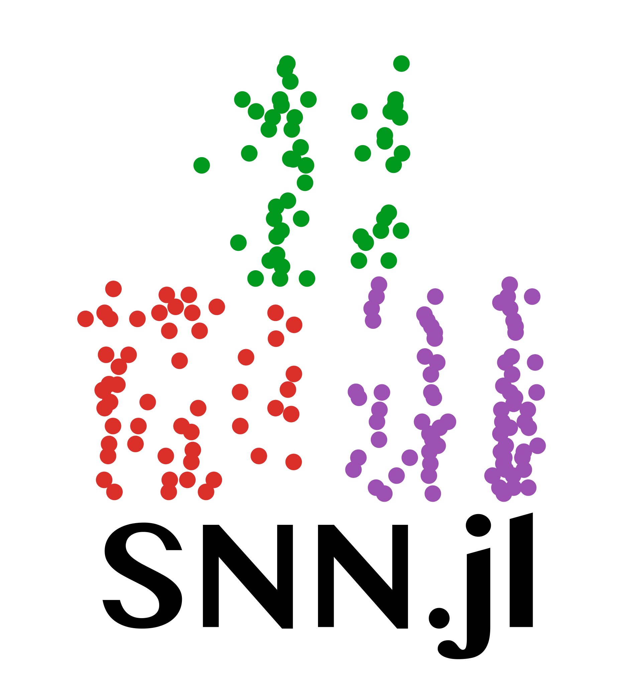

    

<h2 align="center">A Spiking Neural Network framework for Julia

    
  
  

</h2>

SpikingNeuralNetworks.jl is a toolbox written in Julia providing models, plots, and analysis functions for spiking and rate networks simulations.

The SpikingNeuralNetwork.jl package is an umbrella package for:
- `SNNModels.jl`
- `SNNPlots.jl`
- `SNNUtils.jl`
and future contributions of the spiking neural network ecosystem.

**Documentation** is [here](https://juliasnn.github.io/SpikingNeuralNetworks.jl/dev/).

