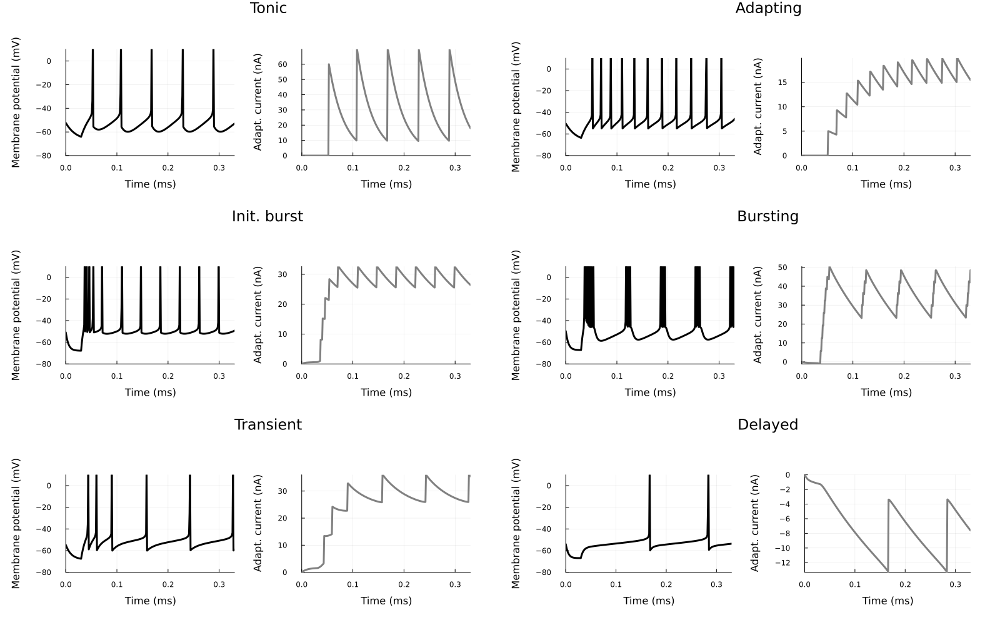
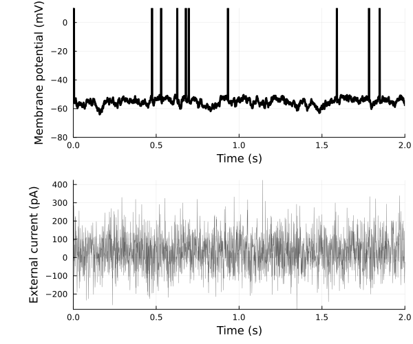
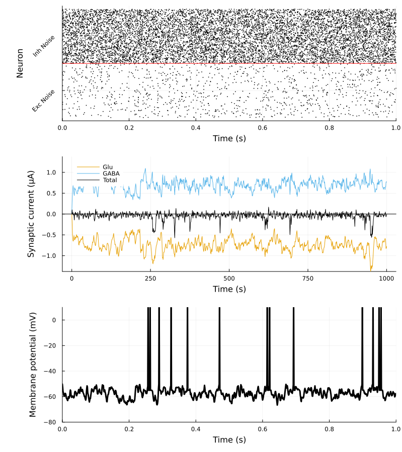
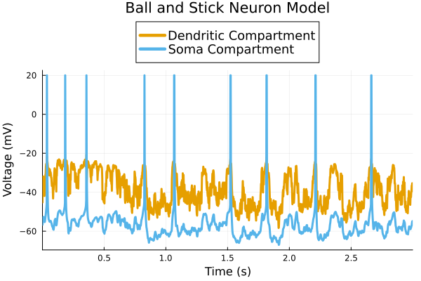
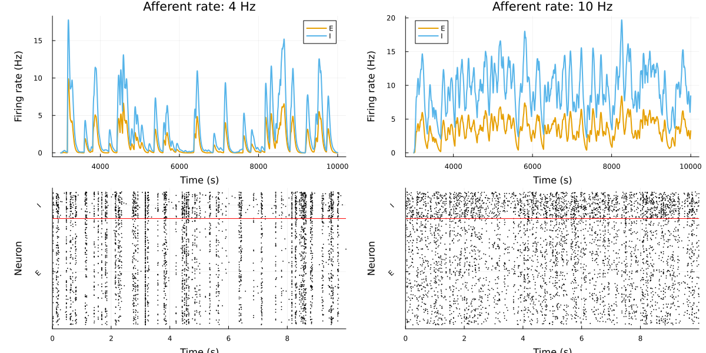
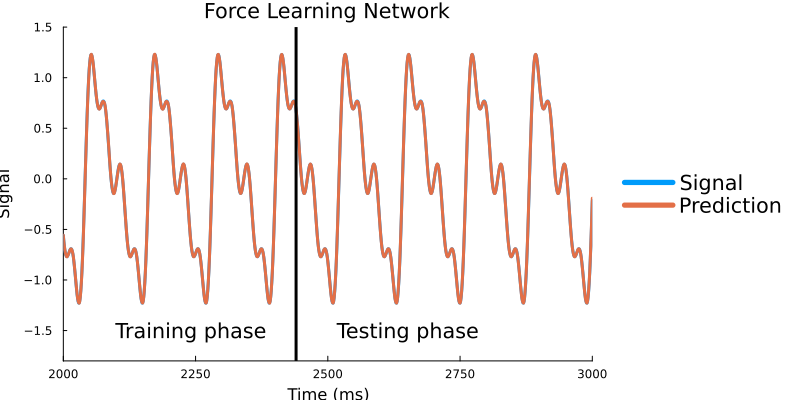

# Tutorial

This tutorial shows how to build and run models with _SpikingNeuralNetworks.jl_. Each section is a
self-contained script: it can be pasted in a Julia session in which `SpikingNeuralNetworks` (and
`CairoMakie`, for the figures) is installed. The library offers many more models than the ones used
here; they are described in the [Model catalogue](catalogue/index.md).

Longer scripts, including the ones that produced the figures in this page, are in the
[examples](https://github.com/JuliaSNN/SpikingNeuralNetworks.jl/tree/main/examples) folder of the
package. Some of those scripts still use the old `Plots` interface of `SNNPlots`; since SNNPlots 0.2
the plotting functions (`vecplot`, `raster`, ...) use `Makie`, as in the snippets below.

Every script starts by loading the library and the unit constants:

```julia
using SpikingNeuralNetworks   # exports SNN, an alias of the module
SNN.@load_units               # defines ms, mV, pA, nS, Hz, ... in the current scope
using CairoMakie              # Makie backend used to render and save the figures
```

The unit system is: time in ms, voltage in mV, current in pA, capacitance in pF, conductance in nS,
resistance in GΩ, rates in kHz (`Hz = 1e-3`). Writing `20ms` or `5nS` therefore only documents the unit;
the stored number is `20f0` or `5f0`.

## AdEx neuron

The adaptive exponential integrate-and-fire (AdEx) model ([Brette and Gerstner, 2005](https://pubmed.ncbi.nlm.nih.gov/16014787/))
reproduces several firing patterns observed under direct current injection
([AdEx firing patterns](https://neuronaldynamics.epfl.ch/online/Ch6.S2.html)). The model has a
membrane potential ``V`` and an adaptation current ``w``:

```math
\begin{align}
    \tau_m \frac{dV}{dt} &= -(V - E_l) + \Delta_T \exp\left(\frac{V - \theta}{\Delta_T}\right) + R\,(I - w - I_{syn}) \\
    \tau_w \frac{dw}{dt} &= a (V - E_l) - w
\end{align}
```

The threshold ``\theta`` relaxes to ``V_t`` with time constant ``\tau_A`` and is increased by
``A_t`` after each spike (both from `PostSpike`; with the default `At = 0` it stays at ``V_t``).
A spike is emitted when ``V \geq 0`` mV: ``V`` is set to 20 mV for that step, then reset to
``V_r`` and held during the refractory period `τabs`; ``w`` is incremented by ``b``. `AdExParameter` is a subtype of `AbstractGeneralizedIFParameter`: the population `AdEx` can be
combined with any synapse model (see [Neuron models: integrate-and-fire family](catalogue/neurons_if.md)).

Changing the membrane time constant, the reset potential and the adaptation parameters gives
different firing patterns:

```julia
using SpikingNeuralNetworks
SNN.@load_units
using CairoMakie

# (pattern, τm (ms), a (nS), τw (ms), b (pA), Vr (mV), I (pA))
patterns = [
    ("Tonic", 20, 0.0, 30.0, 60.0, -55.0, 65),
    ("Adapting", 20, 0.0, 100.0, 5.0, -55.0, 65),
    ("Init. burst", 5.0, 0.5, 100.0, 7.0, -51.0, 65),
    ("Bursting", 5.0, -0.5, 100.0, 7.0, -46.0, 65),
    ("Transient", 10, 1.0, 100, 10.0, -60.0, 65),
    ("Delayed", 5.0, -1.0, 100.0, 10.0, -60.0, 25),
]

fig = Figure(size = (900, 700))
for (n, (name, τm, a, τw, b, Vr, I)) in enumerate(patterns)
    param = SNN.AdExParameter(
        R = 0.5GΩ,
        Vt = -50mV,
        ΔT = 2mV,
        El = -70mV,
        τm = τm * ms,
        Vr = Vr * mV,
        a = a * nS,
        b = b * pA,
        τw = τw * ms,
    )
    E = SNN.AdEx(; N = 1, param)
    SNN.monitor!(E, [:v, :fire, :w], sr = 8kHz)
    model = SNN.compose(; E, silent = true)

    E.I .= 5pA                      # weak current for 30 ms
    SNN.sim!(; model, duration = 30ms)
    E.I .= I * pA                   # current step
    SNN.sim!(; model, duration = 300ms)

    ax = Axis(fig[(n - 1) ÷ 2 + 1, (n - 1) % 2 + 1], title = name, ylabel = "V (mV)")
    SNN.vecplot!(ax, E, :v, add_spikes = true, color = :black)
end
save(joinpath(mktempdir(), "AdEx_neuron_types.png"), fig)
```



## Noise input current

In vivo, neurons are driven by noisy inputs. A simple description splits the input current in a
deterministic and a stochastic component, ``I = I^{det}(t) + I^{noise}(t)``, and the membrane
dynamics of a generalized integrate-and-fire neuron reads

```math
\tau_{m} \frac{d u}{ d t} = f(u) + R I^{det}(t) + R I^{noise}(t)
```

`CurrentNoise` implements such an input: at every time step it sets the target variable to
`I_base` plus a fresh sample ``\xi`` of the distribution `I_dist`. With `α > 0` the new value is
mixed with the previous one, ``I \leftarrow (1-\alpha)(I_{base} + \xi) + \alpha I``, which makes the
noise temporally correlated (see [Stimuli](catalogue/stimuli.md)). In the following example we:

1. define a leaky integrate-and-fire neuron with `Population`, which dispatches on the type of `param`;
2. define a `CurrentNoise` with a deterministic current of 30 pA and Gaussian fluctuations with
   standard deviation 100 pA;
3. attach it to the `:I` variable of the population with `Stimulus` (it returns a `CurrentStimulus`);
4. record, simulate and plot.

```julia
using SpikingNeuralNetworks
SNN.@load_units
using CairoMakie
using Distributions

if_neuron = (
    param = SNN.IFParameter(R = 0.5GΩ, Vt = -50mV, El = -70mV, τm = 20ms, Vr = -55mV),
    spike = SNN.PostSpike(),
    synapse = SNN.SingleExpSynapse(),
)
E = SNN.Population(; N = 1, if_neuron...)
SNN.monitor!(E, [:v, :fire, :I], sr = 2kHz)

# white-noise input current
current_param = SNN.CurrentNoise(E.N; I_base = 30pA, I_dist = Normal(0pA, 100pA))
current_stim = SNN.Stimulus(current_param, E, :I)
model = SNN.compose(; E, I = current_stim, silent = true)
SNN.sim!(; model, duration = 1000ms)

fig = Figure(size = (600, 500))
ax1 = Axis(fig[1, 1], ylabel = "Membrane potential (mV)")
SNN.vecplot!(ax1, E, :v, add_spikes = true, color = :black)
ax2 = Axis(fig[2, 1], ylabel = "External current (pA)", xlabel = "Time (s)")
SNN.vecplot!(ax2, E, :I, color = :gray, lw = 0.5)
save(joinpath(mktempdir(), "noise_current.png"), fig)
```



## Balanced input spikes

In the brain, the membrane potential is driven by the opening of ion channels after presynaptic
spikes rather than by injected currents. Populations of the generalized integrate-and-fire family
accept any of the synapse models listed in [Synapse and receptor models](catalogue/synapses.md); the
excitatory and inhibitory inputs are delivered to the receptor fields `:glu` and `:gaba`
(the aliases `:ge`/`:he` and `:gi`/`:hi` map to the same fields).

Here two Poisson spike trains, one excitatory and one inhibitory, drive an AdEx neuron above
threshold. The large number of input spikes increases the synaptic conductance until it dominates
the leak conductance: the neuron is in the so-called high-conductance state.

`PoissonLayer` defines a layer of `N` independent Poisson sources; `Stimulus(param, population, sym;
conn)` connects it to the population with the connectivity `conn` (connection probability `p` and
mean weight `μ`, see `sparse_matrix`).

```julia
using SpikingNeuralNetworks
SNN.@load_units
using CairoMakie

neuron_parameter = (
    param = SNN.AdExParameter(R = 0.5GΩ, Vt = -50mV, ΔT = 2mV, El = -70mV, τm = 20ms, Vr = -55mV),
    synapse = SNN.DoubleExpSynapse(),
    spike = SNN.PostSpike(τabs = 5ms),
)
E = SNN.Population(; neuron_parameter..., N = 1)

poisson_exc = SNN.PoissonLayer(rate = 1Hz, N = 1000)
poisson_inh = SNN.PoissonLayer(rate = 10Hz, N = 1000)
conn = (p = 1, μ = 5nS)
stim_exc = SNN.Stimulus(poisson_exc, E, :glu; conn, name = "Exc Noise")
stim_inh = SNN.Stimulus(poisson_inh, E, :gaba; conn, name = "Inh Noise")

model = SNN.compose(; E, stim_exc, stim_inh, silent = true)
SNN.monitor!(E, [:v, :fire], sr = 2kHz)
SNN.monitor!(E, [:glu, :gaba], sr = 2kHz, variables = :receptors) # receptor conductances
SNN.monitor!(model.stim, [:fire])
SNN.sim!(; model, duration = 1000ms)

fig = Figure(size = (800, 800))
ax1 = Axis(fig[1, 1], ylabel = "Input neuron")
SNNPlots.raster!(ax1, model.stim)
ax2 = Axis(fig[2, 1], ylabel = "Conductance (nS)")
SNN.vecplot!(ax2, E, :glu, variables = :receptors, label = "glu")
SNN.vecplot!(ax2, E, :gaba, variables = :receptors, label = "gaba")
ax3 = Axis(fig[3, 1], ylabel = "Membrane potential (mV)", xlabel = "Time (s)")
SNN.vecplot!(ax3, E, :v, add_spikes = true, color = :black)
save(joinpath(mktempdir(), "balanced_stimuli.png"), fig)
```



## Ball-and-stick neuron

A classical extension of the point neuron is the ball-and-stick neuron: a passive dendritic
compartment coupled to an active AdEx soma. The dendrite can host voltage-dependent NMDA receptors,
which make its response to synaptic input non-linear. See [Multicompartment neuron models](catalogue/multicompartment.md)
for the equations and for the `Tripod` (two dendrites) variant.

The somatic parameters are given by `adex`, the dendrite geometry by `BallAndStickParameter`
(dendrite length, here a fixed 160 μm, and passive physiology), and the receptors of each
compartment by `soma_syn` and `dend_syn` (defaults: `TripodSomaSynapse` with AMPA and GABA-A,
`TripodDendSynapse` with AMPA, NMDA, GABA-A and GABA-B). Stimuli and synapses target a compartment
with the extra positional argument `:s` (soma) or `:d` (dendrite).

```julia
using SpikingNeuralNetworks
SNN.@load_units
using CairoMakie

adex = SNN.AdExParameter(C = 281pF, gl = 40nS, Vr = -55.6mV, El = -70.6mV, ΔT = 2mV,
                         Vt = -50.4mV, a = 4nS, b = 80.5pA, τw = 144ms)
E = SNN.BallAndStick(N = 1, adex = adex,
                     param = SNN.BallAndStickParameter(ds = [(160um, 160um)]))

stim_exc = SNN.Stimulus(SNN.PoissonLayer(rate = 10Hz, N = 1000), E, :glu, :d;
                        conn = (p = 1, μ = 1nS), name = "noiseE")
stim_inh = SNN.Stimulus(SNN.PoissonLayer(rate = 3Hz, N = 1000), E, :gaba, :d;
                        conn = (p = 1, μ = 4nS), name = "noiseI")

model = SNN.compose(; E, stim_exc, stim_inh, silent = true)
SNN.monitor!(E, [:v_s, :v_d, :fire], sr = 1kHz)
SNN.sim!(; model, duration = 1s)

fig = Figure()
ax = Axis(fig[1, 1], xlabel = "Time (s)", ylabel = "Voltage (mV)", title = "Ball-and-stick neuron")
SNN.vecplot!(ax, E, :v_d, label = "Dendrite")
SNN.vecplot!(ax, E, :v_s, add_spikes = true, label = "Soma")
axislegend(ax)
save(joinpath(mktempdir(), "ballandstick_neuron.png"), fig)
```



## Recurrent EI network

A conductance-based network of excitatory and inhibitory integrate-and-fire neurons driven by
Poisson afferents (parameters in the spirit of the Zerlaut et al. 2019 mean-field network).
The configuration is a nested `NamedTuple`; `@update` returns a modified copy, which is convenient
for parameter sweeps. `compose` collects populations, synapses and stimuli into a model.

The network below is reduced (1000 neurons, 1 s) so that it runs in a few seconds; the figure was
produced with 10000 neurons and 10 s.

```julia
using SpikingNeuralNetworks
SNN.@load_units
using CairoMakie

config = (
    Npop = (E = 800, I = 200),
    exc = SNN.IFParameter(C = 200pF, gl = 10nS, El = -70mV, Vt = -50mV, Vr = -70mV),
    inh = SNN.IFParameter(C = 200pF, gl = 10nS, El = -70mV, Vt = -53mV, Vr = -70mV),
    synapse = SNN.SingleExpSynapse(τe = 5ms, τi = 5ms, E_e = 0mV, E_i = -80mV),
    spike = SNN.PostSpike(τabs = 2ms),
    connections = (
        E_to_E = (p = 0.05, μ = 2nS),
        E_to_I = (p = 0.05, μ = 2nS),
        I_to_E = (p = 0.05, μ = 10nS),
        I_to_I = (p = 0.05, μ = 10nS),
    ),
    afferents = (N = 100, p = 0.1, rate = 20Hz, μ = 4nS),
)

function network(config)
    (; Npop, exc, inh, synapse, spike, connections, afferents) = config
    E = SNN.IF(; N = Npop.E, param = exc, synapse, spike, name = "E")
    I = SNN.IF(; N = Npop.I, param = inh, synapse, spike, name = "I")

    afferent = SNN.PoissonLayer(rate = afferents.rate, N = afferents.N)
    aff_conn = (p = afferents.p, μ = afferents.μ)
    afferentE = SNN.Stimulus(afferent, E, :glu; conn = aff_conn, name = "noiseE")
    afferentI = SNN.Stimulus(afferent, I, :glu; conn = aff_conn, name = "noiseI")

    synapses = (
        E_to_E = SNN.SpikingSynapse(E, E, :glu; conn = connections.E_to_E, name = "E_to_E"),
        E_to_I = SNN.SpikingSynapse(E, I, :glu; conn = connections.E_to_I, name = "E_to_I"),
        I_to_E = SNN.SpikingSynapse(I, E, :gaba; conn = connections.I_to_E, name = "I_to_E"),
        I_to_I = SNN.SpikingSynapse(I, I, :gaba; conn = connections.I_to_I, name = "I_to_I"),
    )
    model = SNN.compose(; E, I, afferentE, afferentI, synapses...,
                        silent = true, name = "Balanced network")
    SNN.monitor!(model.pop, [:fire])
    return model
end

fig = Figure(size = (1000, 600))
for (n, input_rate) in enumerate([4, 10])
    cfg = SNN.@update config begin
        afferents.rate = input_rate * Hz
    end
    model = network(cfg)
    SNN.sim!(; model, duration = 1s)

    frE, r = SNN.firing_rate(model.pop.E, interval = 200ms:10ms:1s, pop_average = true)
    frI, r = SNN.firing_rate(model.pop.I, interval = 200ms:10ms:1s, pop_average = true)
    ax = Axis(fig[1, n], title = "Afferent rate: $input_rate Hz", ylabel = "Firing rate (Hz)")
    lines!(ax, r ./ 1000, frE, label = "E")
    lines!(ax, r ./ 1000, frI, label = "I")
    ax2 = Axis(fig[2, n], xlabel = "Time (s)")
    SNNPlots.raster!(ax2, model.pop, every = 5)
end
save(joinpath(mktempdir(), "recurrent_network.png"), fig)
```



## Synaptic plasticity

Long-term plasticity is attached to a `SpikingSynapse` with the keyword `LTPParam`, short-term
plasticity with `STPParam`. Plasticity is applied only when the model is run with `train!`; `sim!`
propagates spikes but never changes the weights or the short-term variables. The available rules
are described in [Plasticity](plasticity.md) and [Plasticity rules](catalogue/plasticity_rules.md).

```julia
using SpikingNeuralNetworks
SNN.@load_units

E = SNN.IF(N = 200, name = "E")
input = SNN.Stimulus(SNN.PoissonLayer(rate = 10Hz, N = 200), E, :glu;
                     conn = (p = 0.1, μ = 3nS), name = "input")
EE = SNN.SpikingSynapse(E, E, :glu; conn = (p = 0.1, μ = 1nS),
                        LTPParam = SNN.STDPGerstner(), name = "EE")
model = SNN.compose(; E, input, EE, silent = true)

w0 = copy(EE.W)
SNN.sim!(; model, duration = 500ms)     # no weight change
@assert EE.W == w0
SNN.train!(; model, duration = 500ms)   # STDP is applied
println("mean |Δw| = ", sum(abs.(EE.W .- w0)) / length(w0))
```

## FORCE learning

A rate network trained with the FORCE algorithm described in
["Generating Coherent Patterns of Activity from Chaotic Neural Networks"](https://www.sciencedirect.com/science/article/pii/S0896627309005479)
(Sussillo and Abbott, 2009). The network has 200 rate units (`Rate`) connected by an `FLSynapse`,
whose readout `z` is trained online, with recursive least squares, to follow the target signal `f`.
The readout weights are updated only during `train!` (training phase); `sim!` is used for the test
phase. The script below trains for 1 s; the figure was obtained with 2.44 s of training.

!!! warning "Not runnable with SNNModels 1.8.4"
    The parameter types of `FLSynapse` and `PINningSynapse` (`FLSynapseParameter`,
    `PINningSynapseParameter`) are not subtypes of `AbstractConnectionParameter`, so the generic
    `forward!(c, param, dt, T)` and `update_traces!` methods used by the simulation loop do not apply
    to them: in SNNModels 1.8.4 both `sim!` and `train!` stop with a `MethodError` on these
    connections. The script is kept as a reference for the API and the figure was produced with an
    earlier version.

<!-- norun -->
```julia
using SpikingNeuralNetworks
SNN.@load_units
using CairoMakie

S = SNN.Rate(; N = 200)
SS = SNN.FLSynapse(S, S; μ = 1.5, p = 1.0)
model = SNN.compose(; S, SS, silent = true)
SNN.monitor!(SS, [:f, :z], sr = 1000Hz)

A = 1.3 / 1.5
fr = 1 / 60ms
f(t) = (A / 1.0) * sin(1π * fr * t) + (A / 2.0) * sin(2π * fr * t) +
       (A / 6.0) * sin(3π * fr * t) + (A / 3.0) * sin(4π * fr * t)

for t = 0:0.125ms:1000ms        # training phase
    SS.f = f(t)
    SNN.train!(; model, duration = 0.125ms)
end
for t = 1000ms:0.125ms:1500ms   # test phase
    SS.f = f(t)
    SNN.sim!(; model, duration = 0.125ms)
end

fig = Figure(size = (800, 400))
ax = Axis(fig[1, 1], xlabel = "Time (ms)", ylabel = "Signal", title = "FORCE learning")
lines!(ax, SNN.getrecord(SS, :f), label = "Signal")
lines!(ax, SNN.getrecord(SS, :z), label = "Prediction")
vlines!(ax, [1000], color = :black)
axislegend(ax)
save(joinpath(mktempdir(), "force_learning.png"), fig)
```


