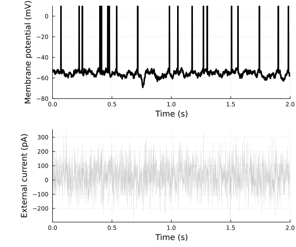

# Tutorial

## AdEx neuron 

A single neuron under a fixed depolaring current can be modeled with an Adaptive Exponential model, with equations:

```math
\begin{aligned}
\tau_m \frac{dV}{dt} &=&  (V^s-V_r) + \Delta_T \exp{\frac{V^s-V_t}{\Delta_T}} - R (w + I) \\
\tau_w\frac{dw}{dt} &=& -w + a (V^s-V_r) + b \cdot \delta(t-t_{spike})
\end{aligned}
```

This model is implemented in the `AdEx` neuron model. The AdEx model can reproduce several different firing patterns observed in real neurons under direct current injections in the soma ([AdEx firing patterns](https://neuronaldynamics.epfl.ch/online/Ch6.S2.html), [Adaptive exponential integrate-and-fire model as an effective description of neuronal activity](https://pubmed.ncbi.nlm.nih.gov/16014787/)).  

```julia
using SNNPlots
import SNNPlots: vecplot, plot
using SpikingNeuralNetworks
using DataFrames
SNN.@load_units

# Define the data
data = [
    ("Tonic", 20, 0.0, 30.0, 60.0, -55.0, 65),
    ("Adapting", 20, 0.0, 100.0, 5.0, -55.0, 65),
    ("Init. burst",  5.0, 0.5, 100.0, 7.0, -51.0, 65),
    ("Bursting",  5.0, -0.5, 100.0, 7.0, -46.0, 65),
    # ("Irregular", 14.4, -0.5, 100.0, 7.0, -46.0, 65),
    ("Transient", 10, 1.0, 100, 10.0, -60.0, 65),
    ("Delayed", 5.0, -1.0, 100.0, 10.0, -60., 25)
]


# Create the DataFrame
df = DataFrame(
    Type = [row[1] for row in data],
    τm = [row[2] for row in data],
    a = [row[3] for row in data],
    τw = [row[4] for row in data],
    b = [row[5] for row in data],
    ur = [row[6] for row in data],
    i = [row[7] for row in data]
)

# Display the DataFrame
```

| Row | Type         | τm  | a    | τw  | b    | ur   | i   |
|-----|--------------|-----|------|-----|------|------|-----|
| 1   | Tonic        | 20  | 0.0  | 30.0| 60.0 | -55.0| 65  |
| 2   | Adapting     | 20  | 0.0  | 100.0| 5.0  | -55.0| 65  |
| 3   | Init. burst  | 5.0 | 0.5  | 100.0| 7.0  | -51.0| 65  |
| 4   | Bursting     | 5.0 | -0.5 | 100.0| 7.0  | -46.0| 65  |
| 5   | Irregular    | 14.4| -0.5 | 100.0| 7.0  | -46.0| 65  |
| 6   | Transient    | 10  | 1.0  | 100  | 10.0 | -60.0| 65  |
| 7   | Delayed      | 5.0 | -1.0 | 100.0| 10.0 | -60.0| 25  |


```julia
plots = map(eachrow(df)) do row
    param = AdExParameter(
        R = 0.5GΩ,
        Vt = -50mV,
        ΔT = 2mV,
        El = -70mV,
        # τabs=0,
        τm = row.τm * ms,
        Vr = row.ur * mV,
        a = row.a * nS,
        b= row.b * pA,
        τw = row.τw * ms,
        At = 0f0
    )


    E = SNN.AdExNeuron(; N = 1, 
        param,
        )
    SNN.monitor!(E, [:v, :fire, :w], sr = 8kHz)
    model = compose(; E = E, silent=true)

    E.I .= Float32(05pA)
    SNN.sim!(; model, duration = 30ms)
    E.I .= Float32(row.i)
    # E.I .= row.i, # Current step
    SNN.sim!(; model, duration = 300ms)

    default(color=:black)
    p1 = plot(vecplot(E, :w, ylabel="Adapt. current (nA)"), 
            vecplot(E, :v, add_spikes=true, ylabel="Membrane potential (mV)", ylims=(-80, 10)), 
            title = row.Type,
            layout = (1,2), 
            size = (600, 800), 
            margin=10Plots.mm)
end

plot(plots...,  
    layout = (7, 1), 
    size = (800, 2000), 
    xlabel="Time (ms)", 
    legend=:outerright,
    leftmargin=15Plots.mm,
)
```


## Noise input current

In 'in vivo' experiments neurons are driven with noisy inputs that can be modeled by splitting the input current in two components
``I = Iˆ{det}(t) + I^{noise}(t)``.

the neuronal dynamics is then determined (for a generalized Leaky and Integrate model) by the equation:

```math
\tau_{m} \frac{d u}{ d t} = f(u) + R I^{det}(t) + R I^{noise}(t)
```

In this description the ``I^{noise}(t)`` is the stochastic component of the external current, which is normally assumed to be a white noise.  Under white noise, the average value of the external current is ``\langle I_{noise} \rangle = 0`` and the autocorrelation is determined by the neuronal timescale and the noise variance, ``\langle I^{noise}(t) I^{noise}(t') \rangle = \tau_m \sigma \delta (t-t')``.

To introduce white noise in the model we can use the `CurrentNoiseParameter` type. In the following example:

1. define a Leaky Integrate-and-Fire neuron ;
2. define a `CurrentNoiseParameter`, it accepts a I_base value (the deterministic current) and a distribution, which we set to be a Normal distribution with zero average and `100pA` variance;
3. `CurrentStimulus` attaches an `<: AbstraactStimulus` to the `:I` variable of the population `E`;
4. record the variables, simulate and plot the results.


```julia

import SNNPlots: vecplot, plot
using SpikingNeuralNetworks
using Distributions
SNN.@load_units

if_parameter = SNN.IFParameter(
    R = 0.5GΩ,
    Vt = -50mV,
    ΔT = 2mV,
    El = -70mV,
    τm = 20ms,
    Vr = -55mV,
)

# Create the IF neuron with tonic firing parameters
E = SNN.IF(; N = 1, 
    param=if_parameter,
    )
SNN.monitor!(E, [:v, :fire, :w, :I], sr = 2kHz)

# Create a withe noise input current 
current_param = CurrentNoiseParameter(E.N; I_base=30pA, I_dist=Normal(00pA, 100pA))
current = CurrentStimulus(E, :I, param=current_param)
model = compose(; E = E, I=current)
SNN.sim!(; model, duration = 2000ms)

p = plot(
    vecplot(E, :v, add_spikes=true, ylabel="Membrane potential (mV)", ylims=(-80, 10), c=:black),
    vecplot(E, :I, ylabel="External current (pA)", c=:gray, lw=0.4, alpha=0.4),
    layout=(
        2, 1
    ),
    size=(600, 500),
    xlabel= "Time (s)",
    leftmargin=10Plots.mm,
)

```



The library also allows to define an arbitrary complex noise function with the `CurrentVariableParameter` type. In this case we must define a function, in this case `sinusoidal_current`, which is called runtime to determine the input current to each neuron in the population, the function must accept three arguments: 
1. a dictionary with the `variables::Dict`;
2. the time of the model `t::Float32`;
3. the index of the neuron `i::Int32`.

We thus define the set of variables that the function uses to determine the current and pass them along the function to `CurrentVariableParameter`. 

In the following example we used a plain sinusoidal current that stimulate the two neurons in the population with a phase a frequency of 1Hz and a phase shift of `3/4 π`

```julia 


# Create a populations with 2 IF neurons
E = SNN.IF(; N = 2, 
    param=if_parameter,
    )
SNN.monitor!(E, [:v, :fire, :w, :I], sr = 2kHz)

# Create a withe noise input current 

function sinusoidal_current(variables::Dict, t::Float32, i::Int)
    # Extract the parameters from the variables dictionary
    amplitude = variables[:amplitude]
    frequency = variables[:frequency]
    phase = variables[:shift_phase]
    
    # Calculate the current value at time t for neuron i
    return amplitude * sin(2 * π * frequency * t + i*phase)
end

variables = Dict(
    :amplitude => 50pA,
    :frequency => 1Hz,
    :shift_phase => π*3/4, # Phase shift for each neuron
)

current_param = SNN.CurrentVariableParameter(variables, sinusoidal_current )
current = CurrentStimulus(E, :I, param=current_param)
model = compose(; E = E, I=current)
SNN.sim!(; model, duration = 2000ms)

p = plot(
    vecplot(E, :v, add_spikes=true, ylabel="Membrane potential (mV)", ylims=(-80, 10)),
    vecplot(E, :I, ylabel="External current (pA)", c=:gray, lw=0.4, alpha=0.4),
    layout=(
        2, 1
    ),
    size=(600, 500),
    xlabel= "Time (s)",
    leftmargin=10Plots.mm,
)

```


## Balanced input spikes

In biophysical networks, and in the brain, neurons' membrane potential is not driven by external currents but by the opening and closing of ionic channels following an afferent spike. Spikes cause the release of vescicles in the synaptic cleft that bind to the ionic channels on the post-synaptic neuron's membrane.  The opening of a ionic channel can lead to a depolarizing or hyperpolarizing current, dependently on its reversal potential. 

In this example we use two spike trains, an excitatory and an inhibitory one, to stimulate a Leaky Integrate-and-Fire neuron above the spike-threshold. The large number of spikes received increases the synaptic conductance of the cell, to the point that it dominates over the leakage conductance term. In this condition, the neurons membrane dynamics is dominated by the external inputs, and the neuron is in the so-called "High-conductance state". 

```julia
using SpikingNeuralNetworks
using SNNPlots
import SNNPlots: vecplot, plot, savefig, gplot
SNN.@load_units

if_parameter = SNN.IFParameter(
    R = 0.5GΩ,
    Vt = -50mV,
    ΔT = 2mV,
    El = -70mV,
    τm = 20ms,
    Vr = -55mV,
    E_i = -75mV,
    E_e = 0mV,
)

# Create the IF neuron
# E = SNN.AdEx(; N = 1, 
#     # param=if_parameter,
#     )
E = SNN.IF(; N = 1, 
    param=if_parameter,
    )

# Create an excitatory and inhibitory spike trains

# Define the Poisson stimulus parameters 
poisson_exc = SNN.PoissonLayerParameter(
    1.2Hz,    # Mean firing rate (Hz) 
    p = 1f0,  # Probability of connecting to a neuron
    μ = 1.0,  # Synaptic strength (nS)
    N = 1000, # Neurons in the Poisson Layer
)

poisson_inh = SNN.PoissonLayerParameter(
    3Hz,       # Mean firing rate (Hz)
    p = 1f0,   # Probability of connecting to a neuron
    μ = 4.0,   # Synaptic strength (nS)
    N = 1000,  # Neurons in the Poisson Layer
)

# Create the Poisson layers for excitatory and inhibitory inputs
stim_exc = PoissonLayer(E, :ge, param=poisson_exc, name="noiseE")
stim_inh = PoissonLayer(E, :gi, param=poisson_inh, name="noiseI")

# Create the model and run the simulation
model = compose(; E = E, stim_exc, stim_inh)
SNN.monitor!(E, [:v, :fire, :w, :ge, :gi], sr = 2kHz)
SNN.monitor!(model.stim, [:fire])
SNN.sim!(; model, duration = 1000ms)

# Plot the results
# gplot is a special function the plots the synaptic currents

SNNPlots.default(palette=:okabe_ito)
p = plot(
    raster(model.stim),
    gplot(E, v_sym=:v, ge_sym=:ge, gi_sym=:gi, 
        Ee_rev=0mV, Ei_rev=-75mV,
        ylabel="Synapti current (μA)"),
    vecplot(E, :v, add_spikes=true, ylabel="Membrane potential (mV)", ylims=(-80, 10), c=:black),
    layout=(
        3, 1
    ),
    fgcolorlegend=:transparent,
    size=(800, 900),
    xlabel= "Time (s)",
    leftmargin=10SNNPlots.Plots.mm,
)
```


## Ball and Stick neuron

We can also implement more complex cellular models. A classical extension of the single-compartment cell, or point-neuron, is the ball-and-stick neuron. This model has a passive dendritic compartment and an active, non-linear soma. 
In our case, the dendritic compartment can be endowed with synaptic non-linearities, such as the NMDA receptor voltage-dependence. The following example implements a ball and stick model with a steep dendritic non-linearity. The cell is stimulated with balanced excitatory-inhibitory inputs on the denrite.

```julia
using SpikingNeuralNetworks
using Plots
using Random
SNN.@load_units
import SpikingNeuralNetworks: Synapse, Receptor, Glutamatergic, GABAergic, DendNeuronParameter, synapsearray, get_time

using BenchmarkTools

Random.seed!(1234)
## Define the neuron model parameters
# Define the synaptic properties for the soma and dendrites
SomaSynapse = Synapse(
    AMPA = Receptor(E_rev = 0.0, 
                    τr = 0.26, 
                    τd = 2.0, 
                    g0 = 0.73),
    GABAa = Receptor(E_rev = -70.0, 
                     τr = 0.1, 
                     τd = 15.0, 
                     g0 = 0.38)
    # SomaSynapse has not NMDA and GABAb receptors, 
    # they are assigned to a NullReceptor and skipped at simulation time
)

DendSynapse = Synapse(
    AMPA = Receptor(E_rev = 0.0, τr = 0.26, τd = 2.0, g0 = 0.73),
    NMDA = Receptor(E_rev = 0.0, τr = 8, τd = 35.0, g0 = 1.31, nmda = 1.0f0),
    GABAa = Receptor(E_rev = -70.0, τr = 4.8, τd = 29.0, g0 = 0.27),
    GABAb = Receptor(E_rev = -90.0, τr = 30, τd = 400.0, g0 = 0.0006), 
)

NMDA = let
    Mg_mM = 1.0mM
    nmda_b = 3.36   # voltage dependence of nmda channels
    nmda_k = -0.077     # Eyal 2018
    SNN.NMDAVoltageDependency(mg = Mg_mM/mM, b = nmda_b, k = nmda_k)
end

# We then define the dendritic neuron model. The dendritic neuron holds has the soma and dendritic compartments parameters, and the synaptic properties for both compartments. 
dend_neuron = DendNeuronParameter(
    # adex parameters
    C = 281pF,
    gl = 40nS,
    Vr = -55.6,
    Er = -70.6,
    ΔT = 2,
    Vt = -50.4,
    a = 4,
    b = 80.5pA,
    τw = 144,
    up = 0.1ms,
    τabs = 0.1ms,

    # post-spike adaptation
    postspike = SNN.PostSpike(A= 10.0, τA= 30.0), 

    # synaptic properties
    soma_syn = SomaSynapse,
    dend_syn = DendSynapse,
    NMDA = NMDA,

    # dendrite
    ds = [160um],
    physiology = SNN.human_dend,
)

E = SNN.SNNModels.BallAndStick(N=1, param = dend_neuron)

poisson_exc = SNN.PoissonLayerParameter(
    10.2Hz,    # Mean firing rate (Hz) 
    p = 1f0,  # Probability of connecting to a neuron
    μ = 1.0,  # Synaptic strength (nS)
    N = 1000, # Neurons in the Poisson Layer
)

poisson_inh = SNN.PoissonLayerParameter(
    3Hz,       # Mean firing rate (Hz)
    p = 1f0,   # Probability of connecting to a neuron
    μ = 4.0,   # Synaptic strength (nS)
    N = 1000,  # Neurons in the Poisson Layer
)

# Create the Poisson layers for excitatory and inhibitory inputs
stim_exc = SNN.PoissonLayer(E, :glu, :d, param=poisson_exc, name="noiseE")
stim_inh = SNN.PoissonLayer(E, :gaba, :d, param=poisson_inh, name="noiseI")

model = SNN.compose(;E, stim_exc, stim_inh)
SNN.monitor!(E, [:v_s, :v_d, :fire, :g_s, :g_d], sr=1000Hz)

#
Plots.default(palette = :okabe_ito)
SNN.sim!(model, 3s)
p = SNN.vecplot(E, :v_d, sym_id=1, interval=1:2ms:get_time(model), neurons=1, label="Dendritic Compartment")
SNN.vecplot!(p, E, :v_s, sym_id=2, interval=1:2ms:get_time(model), neurons=1, add_spikes=true, label="Soma Compartment")
plot!(ylims=:auto, legend=:outertop, legendfontsize=12, xlabel="Time (s)", ylabel="Voltage (mV)", title="Ball and Stick Neuron Model")
```


## Recurrent EI network


```julia
using DrWatson
using Plots
using UnPack
using SpikingNeuralNetworks
SNN.@load_units
##

Zerlaut2019_network = (Npop = (E=8000, I=2000),
    exc = IFSinExpParameter(
                τm = 200pF / 10nS, 
                El = -70mV, 
                Vt = -50.0mV, 
                Vr = -70.0f0mV,
                R  = 1/10nS, 
                τabs = 2ms,       
                τi=5ms,
                τe=5ms,
                E_i = -80mV,
                E_e = 0mV,
                ),

    inh = IFSinExpParameter(
                τm = 200pF / 10nS, 
                El = -70mV, 
                Vt = -53.0mV, 
                Vr = -70.0f0mV,
                R  = 1/10nS, 
                τabs = 2ms,       
                τi=5ms,
                τe=5ms,
                E_i = -80mV,
                E_e = 0mV,
                ),

    connections = (
        E_to_E = (p = 0.05, μ = 2nS),
        E_to_I = (p = 0.05, μ = 2nS),
        I_to_E = (p = 0.05, μ = 10nS),
        I_to_I = (p = 0.05, μ = 10nS),
        ),
    
    afferents = (
        N = 100,
        p = 0.1f0,
        rate = 20Hz,
        μ = 4.0,
        ), 
)

function network(config)
    @unpack afferents, connections, Npop = config
    E = IF(N=Npop.E, param=config.exc, name="E")
    I = IF(N=Npop.I, param=config.inh, name="I")

    AfferentParam = PoissonLayerParameter(afferents.rate; afferents...)
    afferentE = PoissonLayer(E, :ge, param=AfferentParam, name="noiseE")
    afferentI = PoissonLayer(I, :ge, param=AfferentParam, name="noiseI")

    synapses = (
        E_to_E = SpikingSynapse(E, E, :ge, p=connections.E_to_E.p, μ=connections.E_to_E.μ, name="E_to_E"),
        E_to_I = SpikingSynapse(E, I, :ge, p=connections.E_to_I.p, μ=connections.E_to_I.μ, name="E_to_I"),
        I_to_E = SpikingSynapse(I, E, :gi, p=connections.I_to_E.p, μ=connections.I_to_E.μ, name="I_to_E"),
        I_to_I = SpikingSynapse(I, I, :gi, p=connections.I_to_I.p, μ=connections.I_to_I.μ, name="I_to_I"),
    )
    model = compose(;E,I, afferentE, afferentI, synapses..., silent=true, name="Balanced network") 
    monitor!(model.pop, [:fire])
    monitor!(model.stim, [:fire])
    # monitor!(model.pop, [:v], sr=200Hz)
    return compose(;model..., silent=true)
end


##
plots = map([4, 10]) do input_rate
    config = @update Zerlaut2019_network begin
        afferents.rate = input_rate*Hz
    end 
    model = network(config)
    sim!(;model, duration=10_000ms,  pbar=true)
    pr= raster(model.pop, every=40)

    # Firing rate of the network with a fixed afferent rate
    frE, r = firing_rate(model.pop.E, interval=3s:10s, pop_average=true)
    frI, r = firing_rate(model.pop.I, interval=3s:10s, pop_average=true)
    pf = plot(r, [frE, frI], labels=["E" "I"],
        xlabel="Time (s)", ylabel="Firing rate (Hz)", 
        title="Afferent rate: $input_rate Hz",
        size=(600, 400), lw=2)

    # Plot the raster plot of the network
    plot(pf, pr, layout=(2, 1))
end

plot(plots..., layout=(1,2), size=(1200, 600), xlabel="Time (s)", leftmargin=10Plots.mm)
##
```


## FORCE learning

## Recurrent network with dendrites

## Working memory with synaptic plasticity
