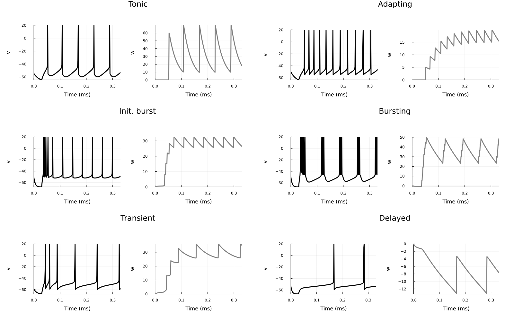

# Models Examples

## AdEx neuron 

A single neuron under a fixed depolaring current can be modeled with an Adaptive Exponential model, with equations:

```math
\begin{aligned}
\tau_m \frac{dV}{dt} &=&  (V^s-V_r) + \Delta_T \exp{\frac{V^s-V_t}{\Delta_T}} - R (w + I) \\
\tau_w\frac{dw}{dt} &=& -w + a (V^s-V_r) + b \cdot \delta(t-t_{spike})
\end{aligned}
```

This model is implemented in the `AdEx` neuron model. The AdEx model can reproduce several different firing patterns observed in real neurons under direct current injections in the soma ([AdEx firing patterns](https://neuronaldynamics.epfl.ch/online/Ch6.S2.html), [Adaptive exponential integrate-and-fire model as an effective description of neuronal activity](https://pubmed.ncbi.nlm.nih.gov/16014787/)).  

```julia
using SNNPlots
import SNNPlots: vecplot, plot
using SpikingNeuralNetworks
using DataFrames
SNN.@load_units

# Define the data
data = [
    ("Tonic", 20, 0.0, 30.0, 60.0, -55.0, 65),
    ("Adapting", 20, 0.0, 100.0, 5.0, -55.0, 65),
    ("Init. burst",  5.0, 0.5, 100.0, 7.0, -51.0, 65),
    ("Bursting",  5.0, -0.5, 100.0, 7.0, -46.0, 65),
    # ("Irregular", 14.4, -0.5, 100.0, 7.0, -46.0, 65),
    ("Transient", 10, 1.0, 100, 10.0, -60.0, 65),
    ("Delayed", 5.0, -1.0, 100.0, 10.0, -60., 25)
]


# Create the DataFrame
df = DataFrame(
    Type = [row[1] for row in data],
    τm = [row[2] for row in data],
    a = [row[3] for row in data],
    τw = [row[4] for row in data],
    b = [row[5] for row in data],
    ur = [row[6] for row in data],
    i = [row[7] for row in data]
)

# Display the DataFrame
```

| Row | Type         | τm  | a    | τw  | b    | ur   | i   |
|-----|--------------|-----|------|-----|------|------|-----|
| 1   | Tonic        | 20  | 0.0  | 30.0| 60.0 | -55.0| 65  |
| 2   | Adapting     | 20  | 0.0  | 100.0| 5.0  | -55.0| 65  |
| 3   | Init. burst  | 5.0 | 0.5  | 100.0| 7.0  | -51.0| 65  |
| 4   | Bursting     | 5.0 | -0.5 | 100.0| 7.0  | -46.0| 65  |
| 5   | Irregular    | 14.4| -0.5 | 100.0| 7.0  | -46.0| 65  |
| 6   | Transient    | 10  | 1.0  | 100  | 10.0 | -60.0| 65  |
| 7   | Delayed      | 5.0 | -1.0 | 100.0| 10.0 | -60.0| 25  |


```julia
plots = map(eachrow(df)) do row
    param = AdExParameter(
        R = 0.5GΩ,
        Vt = -50mV,
        ΔT = 2mV,
        El = -70mV,
        # τabs=0,
        τm = row.τm * ms,
        Vr = row.ur * mV,
        a = row.a * nS,
        b= row.b * pA,
        τw = row.τw * ms,
        At = 0f0
    )


    E = SNN.AdExNeuron(; N = 1, 
        param,
        )
    SNN.monitor!(E, [:v, :fire, :w], sr = 8kHz)
    model = merge_models(; E = E, silent=true)

    E.I .= Float32(05pA)
    SNN.sim!(; model, duration = 30ms)
    E.I .= Float32(row.i)
    # E.I .= row.i, # Current step
    SNN.sim!(; model, duration = 300ms)

    default(color=:black)
    p1 = plot(vecplot(E, :w, ylabel="Adapt. current (nA)"), 
            vecplot(E, :v, add_spikes=true, ylabel="Membrane potential (mV)", ylims=(-80, 10)), 
            title = row.Type,
            layout = (1,2), 
            size = (600, 800), 
            margin=10Plots.mm)
end

plot(plots...,  
    layout = (7, 1), 
    size = (800, 2000), 
    xlabel="Time (ms)", 
    legend=:outerright,
    leftmargin=15Plots.mm,
)
```





## Balanced EI network

## FORCE learning

## Recurrent network with dendrites

## Working memory with synaptic plasticity
