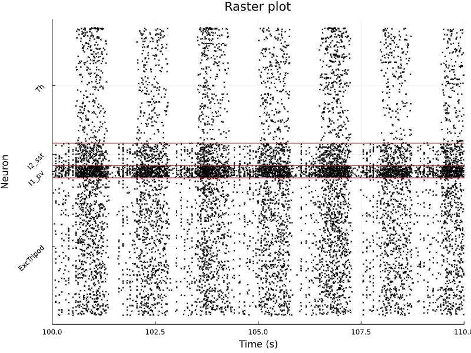

# SpikingNeuralNetworks.jl Documentation


## Overview

Julia Spiking Neural Networks (JuliaSNN) is a library for simulation of biophysical and abstract neuronal network models. 

The library strength points are:
 - Modular, intuitive, and quick instantiation of complex biophysical models;
 - Large pool of standard models already available and easy implementation of custom new models;
 - High performance and native multi-threading support, laptop and cluster-friendly;
 - Access to all model's variables at runtime and save-load-rerun of arbitrarily complex networks;
 - Growing ecosystem for stimulation protocols, network analysis, and visualization ([SNNUtils](https://github.com/JuliaSNN/SNNUtils), [SNNPlots](https://github.com/JuliaSNN/SNNPlots), [SNNGeometry](https://github.com/JuliaSNN/SNNGeometry)).

`SpikingNeuralNetworks.jl` is defined within the `JuliaSNN` ecosystem, which offers `SNNPlots` to plot models' recordings and `SNNUtils` for further stimulation protocols and analysis.

## Simple and powerful

JuliaSNN builds on the idea that a neural network is composed of three classes of objects, the network populations, their recurrent connections, and the external projections they receive. Thus, a JuliaSNN `model` is composed of elements that are subtypes of `AbstractPopulation`, `AbstractConnection`, or `AbstractStimulus`. Populations are the fundamental block, a model must at least include one population.

An example of a model is the classical `Balanced Network` by [Brunel, 2000](https://link.springer.com/article/10.1023/A:1008925309027) :

```julia
================
[Info:  Model: Balanced network
[Info:  ----------------
[Info:  Populations (2):
[Info:  E         : IF        :  4000       IFParamete
[Info:  I         : IF        :  1000       IFParamete
[Info:  ----------------
[Info:  Synapses (4): 
[Info:  E_to_E             : E -> E.ge                     :          : NoLTP      : NoSTP     
[Info:  E_to_I             : E -> I.ge                     :          : NoLTP      : NoSTP     
[Info:  I_to_E             : I -> E.gi                     :          : NoLTP      : NoSTP     
[Info:  I_to_I             : I -> I.gi                     :          : NoLTP      : NoSTP     
[Info:  ----------------
[Info:  Stimuli (2):
[Info:  noiseE     : noiseE -> E.ge                 PoissonStimulus
[Info:  noiseI     : noiseI -> I.ge                 PoissonStimulus
[Info:  ================
```

For each subtype, JuliaSNN offers a library of pre-existing models. In the aforementioned case, an integrate-and-fire population (`IF<:AbstractPopulation`), a spiking synapse (`SpikingSynapse<:AbstractSynapse`) and poisson-distributed spike train (`PoissonStimulus<:AbstractStimulus`).

Leveraging the Julia's [multiple dispatch](https://docs.julialang.org/en/v1/manual/methods/#Methods), the simulation loop calls the function defined for each of these types:

```julia

function sim!(
    P::Vector{TP},
    C::Vector{TC},
    S::Vector{TS},
    dt::Float32,
    T::Time,
) where {TP<:AbstractPopulation,TC<:AbstractConnection,TS<:AbstractStimulus}
    record_zero!(P, C, S, T)
    update_time!(T, dt)
    for s in S
        stimulate!(s, getfield(s, :param), T, dt)
        record!(s, T)
    end
    for p in P
        integrate!(p, getfield(p, :param), dt)
        record!(p, T)
    end
    for c in C
        forward!(c, getfield(c, :param))
        record!(c, T)
    end
end
```

Populations are stimulated, integrated, and their information is propagated through connections. 
Connections and stimuli objects maintain internal pointers to the populations' fields they are attached to. This allow to seamlessy read and updates the populations fields within the `stimulate!` and `forward!` functions.


## Installation

JuliaSNN is not yet available on the public Julia repository. For the moment, you can easily install the last version of the library with:

```julia
]add https://github.com/JuliaSNN/SpikingNeuralNetworks.jl
```

Models can be easily extended by importing the `AbstractPopulation`, `AbstractConnection`, or `AbstractStimulus` types. Guidelines on how to create a model are presented in [Model Extensions ](@ref)

## Examples

Tutorials on how to instantiate network models are presented in [Models Examples](@ref)


